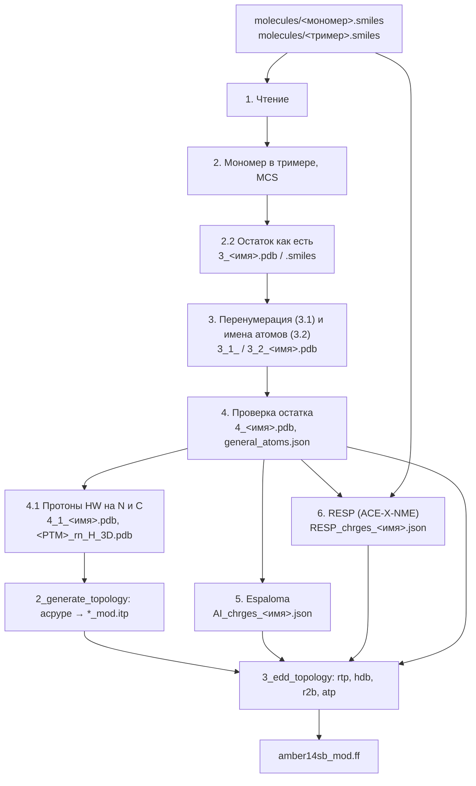

# Карта пайплайна ResParTools

Цель: параметры модифицированного остатка (посттрансляционная модификация, флуоресцентная
метка) для GROMACS amber14sb - имена атомов, топология, заряды, файлы силового поля.



## Шаги ноутбука `1_charge_calculation.ipynb`
Ноутбуки собираются из `notebooks_and_examples/templates/1_charge_calculation.ipynb`
скриптом `make_charge_notebooks.py`; всё, что отличает модификацию, - в ячейке параметров
(`PARAMS`): `PTM_name`, `base_name`, `parent_residue`, `monomer_file`, `trimer_file`,
`naming`, `resp_run`. Окружение ядра - `darwin_ec`.

| Шаг | Что делает | Функции (модуль пакета `respartools/`) | Выход (`molecules/substructure/`, если не указано) |
|---|---|---|---|
| 1 | чтение мономера и тримера | `file_opener` (fileio) | — |
| 2 | мономер в тримере (MCS), подструктура | `match_mon_to_pol` (matching), `draw_mol_grid` (draw) | — |
| 2.2 | остаток как есть, 2D | `save_chem_to_pdb`, `save_chem_to_smiles(atom_map=True)` (fileio) | `3_<имя>.pdb`, `3_<имя>.smiles` (+ `_no_H`) |
| 3.1 | перенумерация: родительский остаток в порядке шаблона, новые атомы - обходом графа | `renumber_residue_atoms` (residue) | `3_1_<имя>.pdb` |
| 3.2 | имена атомов (`greek` - amber-подобные, `index` - для меток), параметры остатка | `rdkit_pdb_modification`, `save_aa_chem_to_pdb` (residue, fileio) | `3_2_<имя>.pdb` |
| 4 | проверка, правка имён (`rename_map`), дубликаты | `modifie_residue_info`, `check_duplicate_atom_names` (residue) | `4_<имя>.pdb`, `../general_atoms.json` |
| 4.1 | протоны HW1/HW2 на N и C (для acpype) | `add_protons_and_renumber_H` (residue), `set_mol_coords` 3D | `4_1_<имя>.pdb/.smiles`, `<PTM>_rn_H_3D.pdb` |
| 5 | заряды Espaloma, остов N H CA HA C O фиксирован (rtp родителя) | `charge_constraints_from_rtp` (charges), `charge` (espaloma-charge_mod) | `../AI_chrges_<имя>.json` |
| 6 | заряды RESP (альтернатива 5) | `prepare_resp_job`, `run_resp`, `load_resp_result`, `compare_charges` (resp, charges) | `../RESP_data/<имя>_capped/`, `../RESP_chrges_<имя>.json` |

## Шаг 6 (RESP) подробно
Протокол как для зарядов amber ff94/ff14SB/ff19SB (Cornell 1995, Cieplak 1995):
1. **Молекула** - `capped_monomer`: ACE-X-NME из SMILES мономера, стереохимия мономера
   (CA - L, центры боковой цепи, E/Z), перенумерована в порядок остатка шага 4.
   Файлы `molecules/<имя>_capped.smiles` - для всех модификаций.
2. **Конформации** - `resp_conformers`: пары (φ, ψ) из `fix_backbone` (по умолчанию αR −60/−40
   и β −120/130) × `n_sidechain=3`; ETKDG → углы → MMFF с замороженными φ/ψ → без контакта
   боковой цепи с остовом → окно 10 ккал/моль от самой низкой → непохожие. Стереохимия каждой
   конформации проверяется.
3. **Оптимизация** HF/6-31G* в psi4 (optking), φ/ψ заморожены, порциями с сохранением
   геометрии (прерванный расчёт продолжается); после неё - проверка контакта.
4. **ESP** (psiresp, сетка MSK) и **двухстадийный RESP** (свой, `_fit_two_stage`): стадия 1 -
   ограничение 0.0005, стадия 2 - CH2/CH3, 0.001. Фиксированы: остов из rtp родителя,
   кэпы ACE/NME из rtp; эквивалентны симметричные и резонансные атомы.
5. **Запуск**: `run='local'` (в окружении `darwin_resp` отдельным процессом) или
   `run='slurm'`; на кластере - `notebooks_and_examples/cluster/resp_cluster.py`
   (`check`, `prepare`, `review`, `submit --chain`, `status`, `collect`, см. `cluster/README.md`).

## Окружения
| Окружение | Файл | Для чего |
|---|---|---|
| `darwin_ec` | `ResParTools_ec.yml` | ноутбуки, шаги 1-5 (Espaloma), Python 3.12 |
| `darwin_resp` | `psiresp_min.yml` (снимок `darwin_resp.lock.yml`) | шаг 6: psi4 1.6.1, psiresp 0.4.2, Python 3.9; тесты |
| `topmol2` | — (локальное) | шаги 2-3: acpype, parmed, Python 3.8 |

Общее окружение `darwin_ec` + `darwin_resp` не собирается: psi4 1.6.1 только для Python ≤ 3.10
со старыми библиотеками, новые psi4 требуют pydantic 2, а psiresp 0.4.2 - pydantic 1.

## Тесты
`tests/test_reference.py` - эталонный набор (Lysine_prop, Lysine_Malonyl, Lysine_Formyl,
Lysine_3M, AF_546_cys): шаги 1-4.1 сравниваются с файлами в git, ограничения зарядов,
кэпированный мономер, подготовка RESP (без квантовой химии).
```bash
conda activate darwin_resp
python -m pytest tests -q -m "not slow"   # ~30 с, лизины
python -m pytest tests -q                 # ~3 мин, вместе с AF546
```

## Пакет `respartools/`
`log` (лог `start_log`), `utils`, `fileio`, `draw`, `matching`, `residue`, `forcefield`,
`charges`, `resp`, `legacy` (старые функции для старых ноутбуков). Ноутбуки подключают его
как раньше: `import ResParTools as pt`. Правило импортов внутри пакета - в `CLAUDE.md`.
