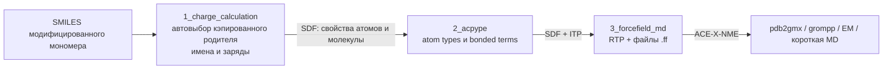
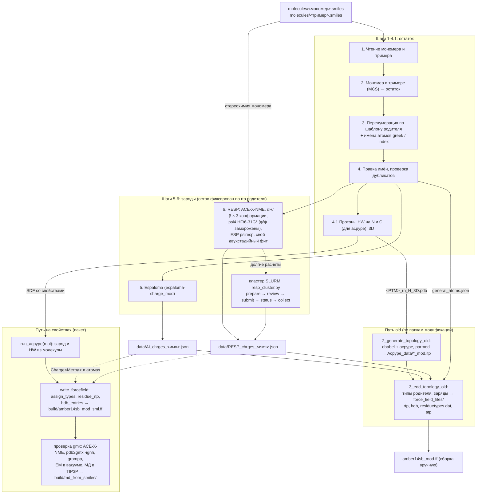

# Карта пайплайна ResParTools

Обновлено: 2026-11-03. Планы - `docs/ROADMAP.md`.

Цель: параметры модифицированного остатка (посттрансляционная модификация, флуоресцентная
метка) для GROMACS amber14sb - имена атомов, топология, заряды, файлы силового поля, проверка в GROMACS.

Старый путь использует словари `{имя: молекула}` и тримеры (`*_old.ipynb`). Новые пользовательские
ноутбуки 1-3 работают на RDKit properties/SDF и принимают только модифицированный мономер. Шаги,
которые меняют состав остатка или границы топологии, сверяются отдельно.


```mermaid
flowchart LR
    S["SMILES модифицированного мономера"] --> N1["1_charge_calculation<br/>автовыбор кэпированного родителя<br/>имена и заряды"]
    N1 -->|"SDF: свойства атомов и молекулы"| N2["2_acpype<br/>atom types и bonded terms"]
    N2 -->|"SDF + ITP"| N3["3_forcefield_md<br/>RTP + файлы .ff"]
    N3 -->|"ACE-X-NME"| G["pdb2gmx / grompp / EM / короткая MD"]
```


```mermaid
flowchart TD
    IN["molecules/&lt;мономер&gt;.smiles<br/>molecules/&lt;тример&gt;.smiles"]

    subgraph S1["Шаги 1-4.1: остаток"]
        A1["1. Чтение мономера и тримера"]
        A2["2. Мономер в тримере (MCS) → остаток"]
        A3["3. Перенумерация по шаблону родителя<br/>+ имена атомов greek / index"]
        A4["4. Правка имён, проверка дубликатов"]
        A41["4.1 Протоны HW на N и C (для acpype), 3D"]
        A1 --> A2 --> A3 --> A4 --> A41
    end

    subgraph Q["Шаги 5-6: заряды (остов фиксирован по rtp родителя)"]
        Q5["5. Espaloma (espaloma-charge_mod)"]
        Q6["6. RESP: ACE-X-NME, αR/β × 3 конформации,<br/>psi4 HF/6-31G* (φ/ψ заморожены),<br/>ESP psiresp, свой двухстадийный фит"]
        CL["кластер SLURM: resp_cluster.py<br/>prepare → review → submit → status → collect"]
        Q6 -. долгие расчёты .-> CL
    end

    IN --> A1
    A4 --> Q5
    A4 --> Q6
    IN -- "стереохимия мономера" --> Q6

    Q5 --> CH["data/AI_chrges_&lt;имя&gt;.json"]
    Q6 --> CHR["data/RESP_chrges_&lt;имя&gt;.json"]
    CL --> CHR

    subgraph OLD["Путь old (по папкам модификаций)"]
        O2["2_generate_topology_old:<br/>obabel + acpype, parmed → Acpype_data/*_mod.itp"]
        O3["3_edd_topology_old:<br/>типы родителя, заряды → force_field_files/<br/>rtp, hdb, residuetypes.dat, atp"]
        O2 --> O3
    end

    subgraph NEW["Путь на свойствах (пакет)"]
        N2["run_acpype(mol): заряд и HW из молекулы"]
        N3["write_forcefield: assign_types, residue_rtp,<br/>hdb_entries → build/amber14sb_mod_smi.ff"]
        NV["проверка gmx: ACE-X-NME, pdb2gmx -ignh, grompp,<br/>EM в вакууме, МД в TIP3P → build/md_from_smiles/"]
        N2 --> N3 --> NV
    end

    A41 -- "&lt;PTM&gt;_rn_H_3D.pdb" --> O2
    CH --> O3
    CHR --> O3
    A4 -- "general_atoms.json" --> O3
    O3 --> FF["amber14sb_mod.ff (сборка вручную)"]

    A41 -- "SDF со свойствами" --> N2
    CH -. "Charge&lt;Метод&gt; в атомах" .-> N3
    CHR -.-> N3
```

## Путь old: шаги ноутбука `1_charge_calculation_old.ipynb`
Ноутбуки `1_charge_calculation_old`, `2_generate_topology_old`, `3_edd_topology_old` собираются
в каждой папке из `notebooks_and_examples/templates/<то же имя>` скриптом `make_charge_notebooks.py`;
всё, что отличает модификацию, - в `PARAMS`: `PTM_name`, `base_name`, `parent_residue`,
`monomer_file`, `trimer_file`, `naming`, `resp_run`. Окружение ядра шага 1 - `darwin_ec`.
Совсем старые ноутбуки (`_K_*`, `_Kcr`, `_resp`, ...) - в `<папка>/archive/`.

| Шаг | Что делает | Функции (модуль пакета `respartools/`) | Выход (`molecules/substructure/`, если не указано) |
|---|---|---|---|
| 1 | чтение мономера и тримера | `file_opener` (fileio) | — |
| 2 | мономер в тримере (MCS), подструктура | `match_mon_to_pol` (matching), `draw_mol_grid` (draw) | — |
| 2.2 | остаток как есть, 2D | `save_chem_to_pdb`, `save_chem_to_smiles(atom_map=True)` (fileio) | `3_<имя>.pdb`, `3_<имя>.smiles` (+ `_no_H`) |
| 3.1 | перенумерация: родительский остаток в порядке шаблона, новые атомы - обходом графа | `renumber_residue_atoms` (residue) | `3_1_<имя>.pdb` |
| 3.2 | имена атомов (`greek` - amber-подобные, `index` - для меток), параметры остатка | `rdkit_pdb_modification`, `save_chem_to_pdb(..., resname=..., no_H=True)` (residue, fileio) | `3_2_<имя>.pdb` |
| 4 | проверка, правка имён (`rename_map`), дубликаты | `modifie_residue_info`, `check_duplicate_atom_names` (residue) | `4_<имя>.pdb`, `data/general_atoms.json` |
| 4.1 | протоны HW1/HW2 на N и C (для acpype) | `add_protons_and_renumber_H` (residue), `set_mol_coords` 3D | `4_1_<имя>.pdb/.smiles`, `<PTM>_rn_H_3D.pdb` |
| 5 | заряды Espaloma, остов N H CA HA C O фиксирован (rtp родителя) | `charge_constraints_from_rtp` (charges), `charge` (espaloma-charge_mod), `save_charges_json(atom_names=)` (fileio) | `data/AI_chrges_<имя>.json` |
| 6 | заряды RESP (альтернатива 5) | `prepare_resp_job`, `run_resp`, `load_resp_result`, `compare_charges` (resp, charges) | `RESP_data/<имя>_capped/`, `data/RESP_chrges_<имя>.json` |
| 2_generate_topology_old | 3D-вход шага 4.1, заряд acpype - сумма формальных зарядов молекулы; obabel PDB → MDL, acpype (`amber`, `gas`), parmed переносит имена (порядок проверяется по элементам) | `pdb_to_chem`, `draw_molecule` | `Acpype_data/<имя>.acpype/<имя>_mod.itp` |
| 3_edd_topology_old | без HW; типы родителя у общих атомов (`general_atoms.json`), новые типы в atp; заряды (порядок сверяется по именам); rtp; residuetypes.dat и hdb | `remove_extra_H`, `read_rtp`, `check_atomtypes`, `load_charges_json`, `hdb_generator` (forcefield, fileio) | `force_field_files/<папка>.rtp`, `aminoacids.hdb`, `residuetypes.dat`, `atomtypes.atp` |

`.rtp` из `force_field_files/` собираются в `notebooks_and_examples/amber14sb_mod.ff/`
(`<Mod>.rtp` - RESP/ручные, `<Mod>_ai.rtp` - Espaloma). rtp меток (`CY3_*`, `CY5_*`, `Cy3_syn`) и
типы GAFF из базового поля вынесены в `notebooks_and_examples/dyes_wip/` до решения по типам.

## Предыдущий промежуточный путь на свойствах
Данные - в свойствах молекулы (`docs/MOL_PROPS.md`). Шаблон `templates/1_charge_calculation_props.ipynb`
генерируется `make_charge_notebooks.py --props`; готовые копии есть в `Lysine_prop`, `Lysine_Formyl`,
`Lysine_Malonyl`, `Lysine_3M`, `AF_546_cys`. Он сохраняет молекулу и атомные данные в RDKit-свойствах
и SDF. Этот шаблон — промежуточная версия: он требует мономер, тример и явный `parent_residue`.
Новые пользовательские ноутбуки описаны ниже.

Проверочные скрипты `build/md_code/lysines_props.py` и `night_validate.py` также используют API пакета.
Результаты проверочных запусков находятся в `build/` (вне git).

## Новые пользовательские ноутбуки для 12 модифицированных лизинов

Шаблоны `templates/1_charge_calculation.ipynb`, `2_acpype.ipynb`, `3_forcefield_md.ipynb` собираются
командой `python make_charge_notebooks.py --workflow [папки...]`. Без списка папок генерируются 36
ноутбуков для 12 лизиновых модификаций. Выполненные версии сохраняются в `<папка>/archive/notebooks/`;
генератор архивирует занятую версию перед заменой и не меняет архив.

Дополнительные проверочные входы можно сгенерировать отдельно:
`python make_charge_notebooks.py --workflow 4PQ ILX SMC SME 2AS`. В этих примерах указан
химический родитель, результат автоматического поиска печатается отдельно. Первый ноутбук
сохраняет изображения мономера, карты сопоставления и зарядов в
`build/notebooks/<папка>/figures/`. На рисунке зарядов у атомов указаны численные значения
с сохранением химических обозначений элементов.

При буквенном именовании первый ноутбук передаёт центральный шаблон в
`rdkit_pdb_modification(parent_reference=parent)`. По карте `ParentName` сохраняются
имена сопоставленных ароматических колец и их водородов. При коллизии с новым
заместителем выбирается первый свободный индекс для тяжёлого атома и его H.
В 4PQ позиции индола сохраняют имена TRP, новая группа получает `OH1`/`HH1`.
Режим `naming='ccd'` зарезервирован для будущего поиска в CCD.

Ручные правки в `modifie_residue_info` задаются словарём
`{текущий индекс RDKit: 'новое имя'}` с нумерацией от нуля. Все замены проверяются
перед записью в AtomName и PDB. Старый словарь имён выдаёт предупреждение
об устаревании и сохраняет прежнее поведение.

| Ноутбук | Вход / шаги | Функции | Результат |
|---|---|---|---|
| 1. `1_charge_calculation.ipynb` | Только SMILES модифицированного мономера; рейтинг родителей по capped PDB; MCS-карта и границы центрального residue; имена, Espaloma и подготовка RESP | `open_mol`, `find_ref_residue`, `renumber_residue_atoms`, `pdb_to_chem`, `extract_residue`, `open_peptide_boundaries`, `rdkit_pdb_modification`, `draw_mol_grid`, `charge_constraints_from_rtp`, `charge`, `prepare_resp_job`, `run_resp` | `build/notebooks/<папка>/4_<имя>.sdf`, `4_1_<имя>.sdf`, RESP-задача |
| 2. `2_acpype.ipynb` | SDF без `HW` с выбранным методом зарядов и отдельная копия с `HW` для acpype; типы переносятся на исходный остаток по порядку и именам | `load_mol`, `run_acpype`, `save_mol` | `build/notebooks/<папка>/5_<имя>.sdf`, SDF с `HW` и `acpype/<имя>.acpype/<имя>_GMX.itp` |
| 3. `3_forcefield_md.ipynb` | SDF остатка без `HW` с зарядами и `AcpypeType`; явное чтение RTP, подготовка пептида ACE-X-NME | `load_mol`, `write_forcefield`, `write_validate_job`, `run_validate`, `validate_report` | `build/amber14sb_mod_smi.ff/<ResName>.rtp` и согласованные файлы поля; `build/md_from_smiles/<папка>/` |

`REF_TEMPLATES['protein_capped']` указывает на `molecules/aminoacids_capped/`: 29 ACE-X-NME PDB,
центральный остаток — номер 2. Все шаблоны читаются `pt.pdb_to_chem`; этот парсер отключает proximity
bonding, если в PDB есть `CONECT`. Автовыбор — структурная подсказка по числу общих атомов, он не
доказывает химическое родство. В ноутбуке печатаются все кандидаты и предупреждение; `parent_override`
принимает точное имя шаблона (например `LYS`). `extract_residue` извлекает центральный residue из
кэпированной молекулы, сохраняет атомные свойства и открывает валентность у срезанных связей. При
повторении номера остатка в нескольких цепях передаётся `chain_id`; без него функция сообщает об
неоднозначности. В ноутбуке
1 общая подструктура задаёт соответствие родительской части; несопоставленные атомы модификации
должны сохраняться. `open_peptide_boundaries` получает capped PDB, выделяет центральный остаток
существующей функцией `extract_residue` и находит его граничные позиции по межостаточным связям с
ACE/NME. MCS-карта `ParentName` переносит эти позиции на пользовательский граф; исключаются только
подстановки, занимающие внешние пептидные связи. Все другие несопоставленные ветви модификации
сохраняются. Неоднозначная группа приводит к ошибке с диагностикой. Список исключённых атомов
записывается в `BoundarySubstituents`. Затем `add_protons_and_renumber_H` добавляет `HW` для acpype.
Частичные заряды рассчитываются на остатке без `HW`; копия с `HW` передаётся acpype, как в прежних
выполненных ноутбуках.

RESP по умолчанию только подготавливается. Локальный расчёт включается явно; для кластера создаётся
`run_resp.sbatch`, который пользователь отправляет через SLURM после проверки задачи. Ray не входит в
этот workflow.

Границы сверены с сохранёнными PDB старого тримерного пути для 12 модифицированных лизинов и AF546:
проверяются имена, атомный состав и связи. Повторная сериализация исходного графа для малонила и лактата
не меняет результат; `Lysine_lac.smi` с `C(=O)[O-]` обрабатывается по MCS и capped-границе, без ожидания
единственной текстовой формы SMILES. Успешная MD проверяется отдельно и не заменяет сравнение графа.

| Шаг | Функции | Что пишется в молекулу / файлы |
|---|---|---|
| 1 | `open_mol` (fileio) | у атомов `SrcIdx`, у молекулы `ModName`, `SourceFile` |
| 2 | `find_residue` (matching) | `PolymerIdx`; открытая валентность N и C - неявные H |
| 3 | `renumber_residue_atoms`, `rdkit_pdb_modification` (residue) | `PrevIdx`, `ParentName`, `AtomName`, `Parent`, `Naming` |
| 4 | `modifie_residue_info`, `check_duplicate_atom_names` | — |
| 4.1 | `add_protons_and_renumber_H` (residue) | `AddedH` (на шаге 3 поля удаляются по нему, не по имени) |
| 5/6 | `charge_constraints_from_rtp`, `charge`, `set_charges` (charges); RESP - `prepare_resp_job(working_dir=OUT/resp)`, `run_resp` | `Charge<Метод>`, `ChargeFixed`, `ChargeMethod` |
| сохранение | `save_mol` / `load_mol` (fileio) | `4_<имя>.sdf`, `4_1_<имя>.sdf` (все свойства), `<PTM>_rn_H_3D.pdb` |
| 2 (acpype) | `run_acpype(mol, workdir, net_charge=None)` (forcefield, acpype из `topmol2`) | обычный остаток: GAFF по умолчанию; изменённый остов: ACE-X-NME, GAFF; `AcpypeType`, `AcpypeItp`, `AcpypeCapMap` |
| 3 (поле) | `write_forcefield` (forcefield): `assign_types`, `residue_rtp`, `hdb_entries` | `AtomType`, `TypeSource`; `<ResName>.rtp`, `<ResName>.hdb`, `residuetypes.dat`, `atomtypes.atp` → `build/amber14sb_mod_smi.ff` |
| проверка | `write_validate_job`, `run_validate(run='local'\|'slurm')`, `validate_report` (gmx) | ACE-X-NME: pdb2gmx -ignh, grompp, EM в вакууме (`em_vac`), при `md_ns > 0` - вода TIP3P, ионы, EM, NVT, NPT, МД; отчёт: предупреждения, Fmax, длины связей против `em_vac.gro` |

Правила шага 3: тип родителя сохраняется, если окружение атома то же (элемент, число соседей,
число H, гибридизация/ароматичность: родитель - по шаблону, остаток - в ACE-X-NME), у водорода - если
окружение не изменилось и у соседей его атома; типы acpype у новых атомов не меняются (CE
ацилированных лизинов - `C8`). Явные параметры (из itp acpype, единицы GROMACS) - только для связей,
углов, диэдралов, которых нет в `ffbonded.itp` по типам. Один парсер rtp - `read_rtp` / `write_rtp` (forcefield).

**Изменённый остов** (N-метил, тиоамид, депсипептид) проходит тот же путь, отдельных функций нет:
- `find_residue`: из сопоставлений, одинаковых по валентности и заряду, берётся то, где больше атомов
  с тем же числом H (иначе метил на N сопоставлялся с C=O соседа);
- `check_parent_residue` / `find_ref_residue`: атом остова шаблона, на месте которого стоит другой
  элемент (S вместо O, O вместо N), - сообщение «изменённый остов», не ошибка
  (`match_data['replaced_backbone']`); `renumber_residue_atoms` ставит его на место атома шаблона,
  свойство `ReplacesParent` вместо `ParentName`;
- `find_backbone_match`, `capped_monomer`: изменённый остов ищется, только если обычного нет;
- имена (`rdkit_pdb_modification`) - по PDB CCD: заместитель на N - `CN`, `HN1-3` (MLE, MVA, SAR),
  O вместо N - `OHN` (2OP, LAC), S вместо O - `S` (GL3); заместитель на N из нескольких тяжёлых атомов
  пока не поддерживается (ошибка);
- `renumber_residue_atoms` ставит `ModifiedBackbone=True` при замене атома остова или тяжёлом
  заместителе у N. `charge_constraints_from_rtp` тогда предупреждает и возвращает пустые ограничения:
  стандартные заряды rtp не фиксируются для химически изменённого остова.
- `run_acpype` для такого остатка строит ACE-X-NME и запускает GAFF; `residue_rtp` переносит параметры
  кэпированных связей в RTP через `-C`/`+N`. `write_forcefield` добавляет использованные GAFF
  atomtypes из acpype ITP в `ffnonbonded.itp` создаваемого поля и массы в `atomtypes.atp`.

## Шаг 6 (RESP) подробно
Протокол как для зарядов amber ff94/ff14SB/ff19SB (Cornell 1995, Cieplak 1995):
1. **Молекула** - `capped_monomer`: ACE-X-NME из SMILES мономера, стереохимия мономера
   (CA - L, центры боковой цепи, E/Z), перенумерована в порядок остатка шага 4.
   Файлы `molecules/<имя>_capped.smiles` - для всех модификаций.
2. **Конформации** - `resp_conformers`: пары (φ, ψ) из `fix_backbone` (по умолчанию αR −60/−40
   и β −120/130) × `n_sidechain=3`; ETKDG → углы → MMFF с замороженными φ/ψ → связи остатка с
   кэпами (ω) только транс, цис исключаются с сообщением (как у Cieplak 1995; у N-метила MMFF даёт и
   цис) → без контакта боковой цепи с остовом → окно 10 ккал/моль от самой низкой → непохожие. Стереохимия каждой
   конформации проверяется.
3. **Оптимизация** HF/6-31G* в psi4, φ/ψ заморожены, одним расчётом до `max_opt_steps=400` шагов.
   Оптимизатор - `optimizer='geometric'` по умолчанию (свой цикл geomeTRIC 1.1: отвергает шаги с ростом
   энергии; `psi4.optimize(engine='geometric')` в psi4 1.6.1 с ним несовместим); `'optking'` - встроенный
   psi4, его же берут старые задачи без ключа в `spec.json`. Не сошлось - геометрия в `current.xyz`,
   повторный запуск продолжает с неё ещё на `continue_steps=100` шагов (история запусков - в `status.json`
   и выводе `status`: вычислений градиента сделано / лимит шагов и энергия). Связи против `start.xyz` проверяются после каждой оптимизации (`_broken_bonds`):
   разрыв или падение psi4 - геометрия в `failed.xyz`, с неё конформация не продолжается. После
   оптимизации - проверка контакта. Повторный `prepare` с другими конформациями пишет задачу в
   `<имя>_01`, `<имя>_02`, ...
4. **ESP** (psiresp, сетка MSK) и **двухстадийный RESP** (свой, `_fit_two_stage`): стадия 1 -
   ограничение 0.0005, стадия 2 - CH2/CH3, 0.001. Фиксированы: остов из rtp родителя,
   кэпы ACE/NME из rtp; эквивалентны симметричные и резонансные атомы (по графу без порядков связей).
5. **Запуск**: `run='local'` (в окружении `darwin_resp` отдельным процессом) или
   `run='slurm'`; на кластере - `notebooks_and_examples/cluster/resp_cluster.py`:
   `check` → `prepare` (текущая задача - в `<имя>_capped.current`) → `review` → `submit`
   (параллельно; `--chain` - по очереди) → `status` → `collect` (`data/RESP_chrges_<имя>.json`
   с именами атомов). См. `cluster/README.md`.

## Окружения
| Окружение | Файл | Для чего |
|---|---|---|
| `darwin_ec` | `ResParTools_ec.yml` | ноутбуки, шаги 1-5 (Espaloma), Python 3.12 |
| `darwin_resp` | `psiresp_min.yml` (снимок `darwin_resp.lock.yml`) | шаг 6: psi4 1.6.1, psiresp 0.4.2, Python 3.9; тесты |
| `topmol2` | — (локальное) | шаги 2-3: acpype, parmed, Python 3.8; `run_acpype` вызывает acpype отсюда |
| `gmx` | `conda create -n gmx -c conda-forge gromacs` | проверка поля: GROMACS 2026.3 (`run_validate`) |

Общее окружение `darwin_ec` + `darwin_resp` не собирается: psi4 1.6.1 только для Python ≤ 3.10
со старыми библиотеками, новые psi4 требуют pydantic 2, а psiresp 0.4.2 - pydantic 1.

Ноутбуки остаются на ядре `darwin_ec`: `pt.run_resp(..., run='local')` запускает RESP в `darwin_resp`
отдельным процессом (окружение ищется рядом с текущим), `run='slurm'` пишет `run_resp.sbatch`.
Сохранённые в старых ноутбуках ядра - `.conda-espaloma` (шаг 1) и `.conda-topmol2` (шаги 2-3).
`ai_topmol.yml` - старое окружение `espaloma` (Python 3.9, dgl 1.1.2).

Установка `darwin_ec` (yml выгружен на кластере: там `prefix:` и сборки CUDA 12). Имя - явно;
без драйвера NVIDIA - подменить виртуальный пакет CUDA (не ниже 12.4: этого требует закреплённый
ffmpeg), torch и dgl тогда работают на CPU:
```bash
CONDA_OVERRIDE_CUDA=12.4 conda env create -n darwin_ec -f ResParTools_ec.yml
conda remove -n darwin_ec --force -y espaloma_charge
```
Вторая команда обязательна: yml ставит upstream `espaloma_charge=0.0.8`, а ноутбуки добавляют
`espaloma-charge_mod` через `sys.path.append` (в конец пути), и копия из site-packages его заслоняет.
Признак: `charge() got an unexpected keyword argument 'constraints'`.

## `espaloma-charge_mod/`
Изменённая копия Espaloma Charge (нетронутая - `espaloma-charge/`, отличия в `app.py`, `models.py`,
`utils.py`). Главное: `charge(mol, constraints={индекс_атома: заряд})` - последний слой
`ChargeEquilibrium` заменяется на `ChargeEquilibrium_mod`, который фиксирует заданные атомы и
распределяет оставшийся заряд только по свободным. Так модифицированный остаток сохраняет заряды
остова amber14sb. Веса модели скачиваются при первом вызове (URL в `app.py`). Тесты upstream:
`cd espaloma-charge && pytest espaloma_charge/tests`; у `_mod` своих тестов нет.

## Особенности ноутбуков
- Относительные пути считаются от папки модификации (там Jupyter запускает ядро). Ноутбуки с
  `os.chdir` задают в первой ячейке `ROOT_DIR` (абсолютный путь `notebooks_and_examples/`, строка
  защищена от повторного запуска) и строят от него все пути. Абсолютные пути кластера не добавлять
  (старый `/home/_projects/2022_md_FRET_nv/param_R_CIT` - та же папка `notebooks_and_examples/`).
- Сохранённые выводы старых ноутбуков содержат старые пути и трассировки `param_tool` (так модуль
  назывался до 7f1d61a) - это история, их не переписывали.

## Лог для отладки
Включается в ячейке ноутбука, по умолчанию выключен:
```python
pt.start_log()        # новая папка logs/<дата_время>/ в текущей папке модификации
pt.log_note('заряды Espaloma', charges=charges)   # своя запись из ноутбука
pt.stop_log()
```
В папке запуска: `log.txt` (вызовы с параметрами и вложенностью, сообщения функций, словари
сопоставления, записанные файлы, время), `calls.jsonl` (то же в машинном виде), `files/` (молекулы
вызовов верхнего уровня в PDB, SDF, mol2, SVG с подписями «индекс:имя»). В заголовке: ноутбук,
окружение, версии пакетов, ветка, коммит, незакоммиченные файлы, sha256 модуля. Логируются функции
с `@logged`; у функций с `@data_to_dict` он ставится под ним. `charge()` Espaloma вызывается из
ноутбука, поэтому в лог попадает только через `log_note`.

## Файлы в папке модификации
| Папка | Что | В git |
|---|---|---|
| `molecules/` | SMILES; `aminoacids_capped/` - 29 ACE-X-NME шаблонов; `substructure/` - файлы старого пути | да |
| `data/` | `AI_chrges_*.json`, `RESP_chrges_*.json`, `general_atoms.json` | да |
| `Acpype_data/` | acpype и `*_mod.itp` (путь old) | да |
| `force_field_files/` | rtp, hdb, residuetypes.dat, atp (путь old) | да |
| `RESP_data/` | задачи и расчёты RESP | нет |
| `archive/` | выполненные и устаревшие ноутбуки, старые заряды и запуски psiresp | да |
| `logs/` | лог `start_log` | нет |

## Тесты
`tests/test_reference.py` - эталонный набор (Lysine_prop, Lysine_Malonyl, Lysine_Formyl,
Lysine_3M, AF_546_cys): шаги 1-4.1 сравниваются с файлами в git, границы для 12 лизинов,
сохранение модификационных атомов и добавление `HW`, ограничения зарядов,
кэпированный мономер, подготовка RESP (без квантовой химии); кэпированная библиотека - все 29 PDB
сверяются по RTP-порядку атомов и связям с кэпами; авто-выбор родителя - для 12 лизинов по LYS/LYN.
`tests/test_backbone_variants.py` - изменённый остов (N-метил-Ala и -Lys, тио-Ala, лактат депсипептида):
имена против ручного эталона по PDB CCD, ограничения зарядов, транс-связи с кэпами в конформациях RESP.
```bash
conda activate darwin_resp
python -m pytest tests -q -m "not slow"   # ~2 мин, лизины
python -m pytest tests -q                 # вместе с AF546
python -m pytest validation -q            # ~40 с
```
`validation/` - проверка корректности против независимых эталонов (стандартные остатки и
`aminoacids.rtp` amber14sb); описание и список проверок - [`validation/README.md`](../validation/README.md).

## Пакет `respartools/`
`log` (лог `start_log`), `utils`, `fileio`, `draw`, `matching`, `residue`, `forcefield`
(rtp/itp, acpype, типы, поле), `charges`, `resp`, `gmx` (проверка в GROMACS), `legacy` (старые
функции и старые вызовы с предупреждением). Ноутбуки подключают его как раньше: `import ResParTools as pt`.

Правило импортов внутри пакета: `log` и `utils` импортируются в начале модуля (декораторы,
пути), остальные модули пакета - в **конце** модуля, чтобы взаимные ссылки не ломали импорт.
Код совместим с Python 3.8: пакет импортируется в `topmol2` (3.8), `espaloma`, `darwin_resp` (3.9) и
`darwin_ec` (3.12), поэтому без `match` и без аннотаций `X | Y` и `list[int]`.
`ResParTools.py` реэкспортирует все имена всех модулей (включая `_private`), так что старые ноутбуки
работают без изменений. Функции с `@data_to_dict` принимают путь, список или словарь и возвращают
словарь по имени файла.
